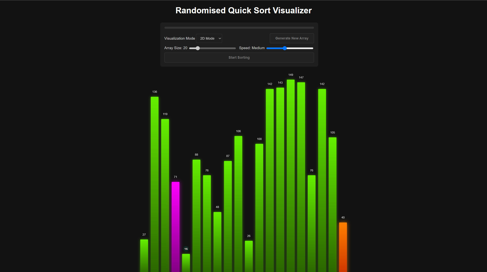
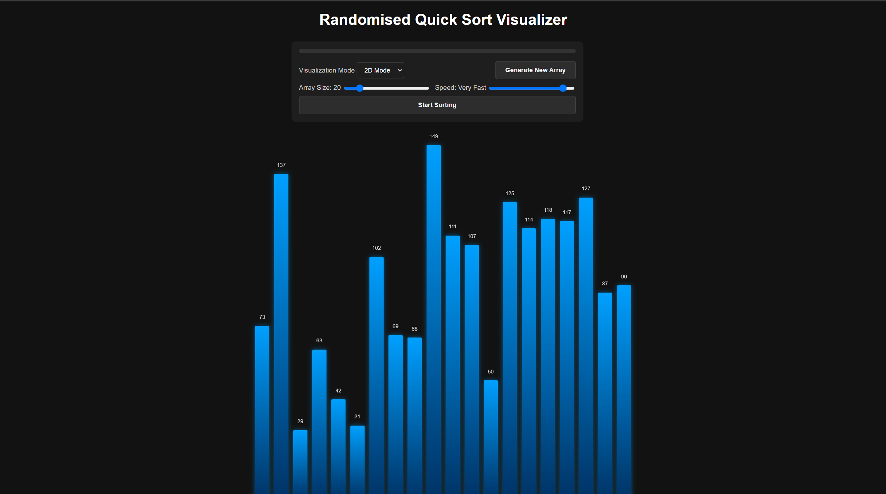
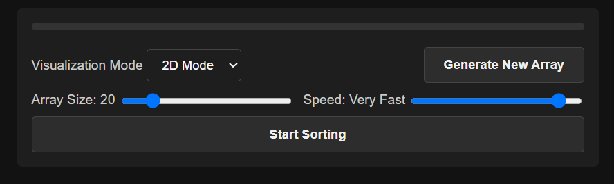

# Randomized Quick Sort Visualizer

An interactive tool to demonstrate the **Randomized Quick Sort** algorithm in a clean 2D representation.



## Overview

This project visualizes the randomized quick sort algorithm in real time using a 2D bar chart. It demonstrates how the algorithm picks a random pivot, partitions the array, and recursively sorts the segments.

## Features

- **2D Visualization**
  - Bar graph representation of the array
  - Dynamic updates to show comparisons, swaps, and sorted regions

  

- **Interactive Controls**
  - Adjustable array size (5–100 elements)  
  - Variable sorting speed (Slow to Instant)  
  - Draggable control panel  
  - Generate new random arrays instantly  

  

- **Visual Feedback**
  - Color-coded bars:
    - Pivot
    - Comparing
    - Sorted
  - Smooth animations throughout the sort process  
  - Subtle success animation on completion  

- **Optimized for Performance**
  - Efficient DOM updates  
  - Adaptive rendering for different array sizes  
  - Configurable delays for real-time control  

## Project Structure

```
quicksort_visualizer/
│
├── index.html          # Main HTML file
├── styles.css          # CSS styles
├── script.js           # Core JavaScript logic
│
├── images/             # Screenshots and UI assets
│   ├── visualizer.png
│   ├── 2d.png
│   └── control.png
│
└── README.md           # Project documentation
```

## Technologies Used

- HTML5  
- CSS3  
- JavaScript (ES6+)

## Demo

### Video Demo  

### Live Demo  

## Usage

1. Adjust array size using the slider  
2. Set sorting speed as needed  
3. Click **"Generate New Array"** to randomize  
4. Click **"Start Sorting"** to begin the randomized quick sort process  

## Algorithm Details

### Time Complexity
- Best Case: O(n log n)  
- Average Case: O(n log n)  
- Worst Case: O(n²) (minimized due to random pivot selection)

### Space Complexity
- O(log n) (due to recursion)

## Contributors

- Akanksha Agroya – 16010123031 – A2  
- Aarya Kulkarni – 16010123007 – A1  
- Aditya Belgaonkar – 16010123026 – A2  
